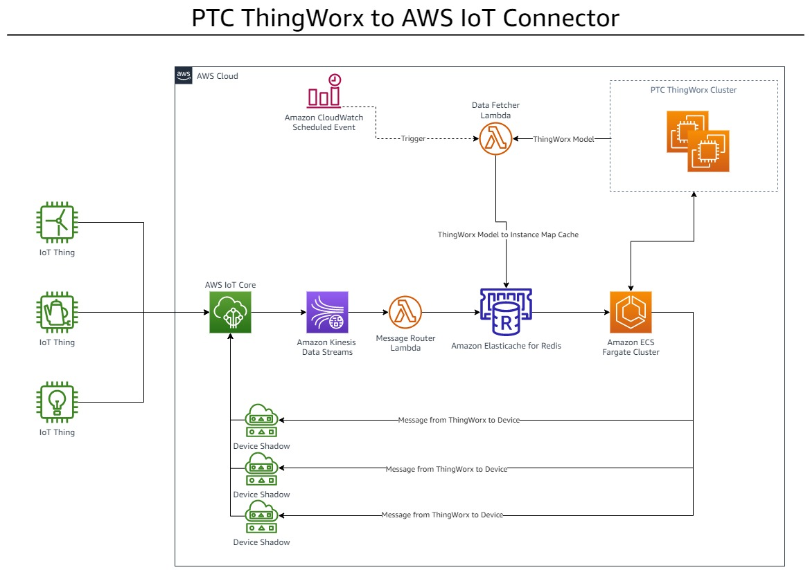

# Thingworx AWS cloud connector
This solution is designed to allow Things connected to AWS IotCore publishing MQTT messages to connect to an instance of Thingworx server. 
The solution consists of 3 parts as explained below. Please note that this stack only supports MQTT protocol.

### ThingworxDataFetcherLambda
Thingworx data fetcher lambda function is responsible for fetching Thing Models and Things from thingworx and populating the name of each Thing 
as a key in Redis cluster. Each key in Redis will contain the data model for the Thing as well the name of Redis topic for the 
instance of clint connector application that it is assigned to. upon reading things from Thingworx this lambda randomly assigns each Thing 
a topic name that a particular instance of ThingWorxClientConnectorApp would be subscribed to. When there are not enough slots available for new Things across 
any of already running instances of ThingWorxClientConnectorApp this lambda lunches a Fargate task with an instance of thingworx client connector application and assigns
the new Thing to its topic name by writing a new key value par in Redis. By default, every 1000 Things are assigned to one instance of ThingWorxClientConnectorApp running in 
Fargate cluster.

### ThingWorxClientConnectorApp
Thingworx client connector application is a spring boot application that is launched inside a Fargate task started by ThingworxDataFetcherLambda function as described above.
it is responsible for subscribing to the topic that is passed into it by ThingworxDataFetcherLambda function and delivering telemetry messages as well device status signals it receives from the
topic to Thingworx server. This application is also responsible for updating device shadow for each Thing in AWS when property values for the associated Thing gets updated in Thingworx. 

### MessageRouterLambda
Message router lambda function is responsible for receiving telemetry and device status messages from kinesis stream and delivering those messages to correct instance of ThingWorxClientConnectorApp.
upon receiving messages from kinesis it uses the clientId present in each message to fetch the data shape and topic that it needs to forward the message to the correct instance of 
ThingWorxClientConnectorApp. this is achieved by fetching a value from Redis by using clientId as key. This value would have been previously put into redis by ThingworxDataFetcherLambda as described above

Below system diagram describes how everything is tied together:

### Automatic deployment
For easy deployment into AWS cloud we have provided a 
Cloud Formation script that will create all necessary AWS resources. Please follow below steps if you wish to use the Cloud formation script.

1. log into your AWS cloud console.
2. Open S3 service console
3. Create a bucket with a desired name in your target AWS region with all default settings
4. inside the newly created bucket create a folder called `deploy` (case-sensitive)
5. Upload all files from `deploy` directory inside this repository to `deploy` folder on S3 created in step 4
6. Verify that you are still in te same region where you have created the S3 bucket in step 3
7. open Cloud Formation console.
8. Click on `Create Stack`
9. Choose `With new resources (standard)`
10. In `Prerequisite - Prepare template` select `Template is ready` option
11. in `Specify template` chose `Upload a template file` and click `Choose File`
12. Choose `IoT-TWX-Connector-CloudFormation.yaml` file in this repository and upload it to AWS CloudFormation
13. Hit the `next` button
14. Provide all necessary parameters specific to your environment with descriptions as below:
    - `Cidr` (VPC network address space). default value `10.0.0.0/24`
    - `Environment` execution environment for this stack. default value `PROD`
    - `FargateCPU` defines minimum CPU requirements for cloud connector APP tasks. default value `512` (512 representing 0.5 vCPU) click here for more info: [AWS::ECS::TaskDefinition](https://docs.aws.amazon.com/AWSCloudFormation/latest/UserGuide/aws-resource-ecs-taskdefinition.html#cfn-ecs-taskdefinition-cpu)
    - `FargateRAM` defines minimum memory required for cloud connector APP tasks. default value `1024`
    - `KinesisShardCount` number of shards on each kinesis stream used to deliver telemetry message from IoTCore to MessageRouterLambda. default value `2`
    - `LogLevel`	global log level for the entire stack. default value `ERROR`
    - `MeasurementTopicName`	the topic used by Things on AWS IoTCore to publish telemetry messages. default value `/sample/topic`
    - `MessageRouterLambdaBatchSize`	defines hominy messages should be buffered by kinesis before MessageRouterLambda execution is called. default value `2000`
    - `MessageRouterLambdaMemory`	defines minimum memory requirements for MessageRouterLambda. default value `512`
    - `MessageRouterLambdaTimeout` defines execution timeout in seconds for MessageRouterLambda. default value `900` (15 mins)
    - `MessageRouterLambdaZipFile` defines the name of zip file for the MessageRouterLambda deployment package. default value `MessageRouterLambda.zip`
    - `NumberOfThingsPerInstance`	defines how many Things should be handled by each instance of ThingWorxClientConnectorApp. default value `1000`
    - `RedisNodeType` defines the size of the virtual machine for each node in Redis cluster. default value `cache.t2.micro` (currently the cheapest option)
    - `S3Bucket` the name of bucket containing all required files for deploying the stack into AWS cloud created in step 3. default value	`S3-BUCKET-NAME` (please change this to reflect the name of bucket created in step 3)
    - `S3Folder` the name of the folder created in step 4. default value `deploy`
    - `ThingworxApiKey` API key for accessing Thingworx API. default value `your-api-key`
    - `ThingworxDataFetcherLambdaMemory` defines minimum memory requirements for ThingworxDataFetcherLambda. default value `1024`
    - `ThingworxDataFetcherLambdaTimeout` defines execution timeout in seconds for ThingworxDataFetcherLambda. default value `900` (15 mins)
    - `ThingworxDataFetcherLambdaZipFile`	defines the name of zip file for the ThingworxDataFetcherLambda deployment package. default value `ThingworxDataFetcherLambda.zip`
    - `ThingworxServerUrl` defines the URL for Thingworx server url. default value `http://your-twx-hostname/Thingworx/WS`
15. Click next
16. On configure stack options page leave everything as default and click `next`
17. On the next page review your settings and tick the checkbox `I acknowledge that AWS CloudFormation might create IAM resources with custom names.` and click `Create Stack` button
18. Wait for the deployment to finish. approximate deployment time is 15 minutes.
19. Successful deployment would result in `CREATE_COMPLETE` status shown in front of stack name. Make sure to refresh `Events` tab to get the latest status messages.
20. After deployment has finished successfully open AWS CodeBuild. under Build `Projects` click on `TWXIoTConnector` project
21. On the next page click `start build`
22. wait for the build to complete. It will take approximately 3 minutes.
23. If build was successfully finish the stack is fully operational

### Post deployment test
After finishing steps above you should be able to test the stack by registering Things on AWS Iot core. with steps described below:
1. Create a new Thing in AWS IotCore and call it `MyTestDevice1`. Please adhere to Thingworx naming conventions for naming Things otherwise messages
   From IotCore will not be routed to Thingworx. Make sure to add a classic shadow (`Unnamed shadow (classic)`) for the Thing in AWS IotCore. This is required for sending messages to the device from Thingworx
2. Create a Thing in Thingworx called `MyTestDevice1` with desired telemetry properties. Please adhere to below rules:
    -Name of thing must exactly match the name you used in step 1 to create the Thing in AWS IotCore
    -Each Thing has to be attached to a Tag with `name` set to `AWS_CONNECTED_THING`. The tag must have `Vocabulary Terms` with value `AWS_CONNECTED_THING`
    -Each of the properties defined on an AWS connected Thing in Thingworx must have a category with value `AWSConnectorBound`
    -The Binding for each property on `MyTestDevice1` in Thingworx must be set to `Remotly Bound` with the same bind name as the property
3. After adding `MyTestDevice1` to Thingworx wait for 1 hour for `ThingworxDataFetcherLambda` to run. (ThingworxDataFetcherLambda is run every hour). Alternatively you could run ThingworxDataFetcherLambda manually from AWS lambda console 
4. Test the connectivity from your device to AWS IotCore making sure that you pass the name of Thing as defined Thingworx in `Client` parameter when connecting the Thing to AWS IotCore.
5. Start publishing messages on topic `/sample/topic` from your Thing. Messages should be in JSON format wih the same property names as what you have defined in `MyTestDevice1` on Thingworx. see below for sample payload:
   `{"temp": 10, "waterLevel": 12, "state": "reporting" }`
6. you should now see that the Thing shows as connected in Thingworx and property values should be updated when you publish new messages from the device to IoTCore.

### Security
See [CONTRIBUTING](https://github.com/aws-samples/aws-iot-thingworx/blob/main/CONTRIBUTING.md#security-issue-notifications) for more information.

### License
This library is licensed under the MIT-0 License. See the LICENSE file
